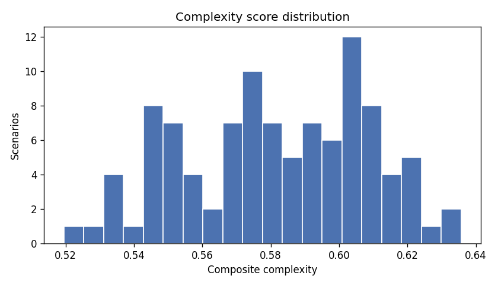
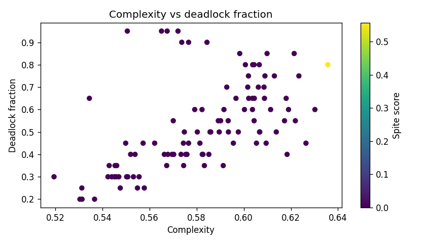

# AXIOM-02: A Deterministic Simulation Engine for Modeling High-Stakes Cognitive Dissonance and Drive-Conflict Resolution

**Zierax** · [https://github.com/Zierax/Axiom-02](https://github.com/Zierax/Axiom-02)

**Version 2.0.0** · Licensed under CC BY-NC 4.0 (see [LICENSE](LICENSE))

> ## ⚠ DISCLAIMER
> **AXIOM-02 does NOT claim to create artificial consciousness, sentience, or a mind.**
> It is a deterministic *simulation instrument* for studying the structure of conflicted decision-making — an epistemological research tool, **not** an ontological claim of machine awareness.

---

## Abstract

We present AXIOM-02, a fully deterministic simulation engine that models autonomous decision-making under high-stakes cognitive dissonance through a mutual-inhibition drive network operating over eighteen competing affective drives (grief, rage, fear, love, sacrifice, revenge, spite, cold logic, etc.). The system does not classify or predict human behaviour; instead, it instantiates a competitive, fatiguing, neuromodulator-coupled decision process and reports the *structure* of that process — whether it deadlocks, oscillates, resolves through spite-driven defiance, or converges on a utility-maximising action. A composite deliberative-complexity metric Φ ∈ [0, 1] is derived from eight criteria (deadlock depth, oscillation amplitude, spite intensity, meta-frustration, dissonance breaks, neuromodulator voltage, narrative stability, temporal entropy) as a *diagnostic* summary of the engine's internal dynamics.

The benchmark suite comprises **102 literary and philosophical scenarios** drawn from Dostoevsky, Tolstoy, Shakespeare, Kafka, Orwell, Camus, and original ethical dilemmas. All runs are deterministic under a fixed seed (default 42). Measured at seed 42, the suite yields mean Φ = 0.438 (σ = 0.140, range [0.167, 0.713]) with 53 scenarios classified COMPLEX (Φ > 0.50), 29 PARTIAL (0.30 ≤ Φ ≤ 0.50), and 20 REFLEXIVE (Φ < 0.30). **The honest headline is action fidelity:** the engine's chosen action matches the scenario's documented human-expected action in **66.7%** of scenarios, versus 33.3% for an argmax (cold-rational) baseline and 28.4% for random selection (chance ≈ 24%). The composite itself is dominated by a single criterion (C3, irrationality; ρ = 0.944, R² = 0.891) — see [docs/RESEARCH_AUDIT_2026.md](docs/RESEARCH_AUDIT_2026.md) for the full falsification analysis; we recommend treating Φ as a diagnostic rather than a validated complexity measure until the residue-tracking and per-scenario isolation issues described there are resolved.

**Crucially, this work does not claim that AXIOM-02 possesses consciousness, sentience, or phenomenal experience.** It is a computational instrument for studying the structural conditions under which conflicted decision-making resists reduction to utility functions — an epistemological tool, not an ontological one. See the full disclaimer in [`src/README.md`](src/README.md).

---

## 1. Introduction

The question of what it means for a system to *deliberate* rather than *compute* has occupied cognitive science, philosophy of mind, and artificial intelligence for decades. Standard models of decision-making — whether expected-utility maximisation, reinforcement learning, or deep neural policy networks — treat conflict as noise to be minimised or as a convergence problem for optimisation. Yet human moral cognition is characterised precisely by the *irreducibility* of certain conflicts: situations in which an agent can identify the utility-maximising action but cannot bring itself to take it, or in which it acts *against* its own interests to assert autonomy, or in which it simply paralyses under the weight of competing drives.

AXIOM-02 operationalises this intuition. Rather than asking whether a system *feels* conflict, we ask whether its internal dynamics — under mutual inhibition, neuromodulatory gain control, epigenetic sensitivity, temporal accumulation of residue, circadian state, and fatigue — produce measurable signatures that correspond to what in biological agents we recognise as deliberation. The system is fully deterministic and auditable: every decision is traceable to the drive activations that produced it.

This approach follows a tradition of computational models of affect and cognition, including:
- **Grossberg's Adaptive Resonance Theory** (1976): competitive neural dynamics for cognitive-emotional integration.
- **Damasio's Somatic Marker Hypothesis** (1994): the role of embodied signals in guiding decision-making.
- **Minsky's Emotion Machine** (2006): the view of mind as a society of interacting resources.
- **Rolls' Neural Basis of Emotion** (2013): reinforcement-based models of affective processing.

AXIOM-02 extends these by providing a concrete, deterministic, and fully open implementation that can be run, inspected, and critiqued by any researcher.

---

## 2. The AXIOM-02 Framework

### 2.1 Drive Network Architecture

The engine centres on a mutual-inhibition drive network of 18 drives, each with a baseline activation that is modulated by scenario parameters, neuromodulator state, epigenetic sensitivity, and associative memory residues. Drives compete through a softmax-like interaction with inhibitory coupling; the resulting activation vector is passed through an action resolver that selects from scenario-specific action options. See [`src/axiom02/core/`](src/axiom02/core/) for the full implementation.

### 2.2 The Decision Pipeline

```
Scenario Input → Parameter Vector → Drive Activations
  → Epigenetic Modulation (long-term sensitivity)
  → Associative Memory (similar past trauma)
  → Moral Residue (cascade/temporal contamination)
  → Neuromodulator Gating (dopamine, serotonin, cortisol, norepinephrine, oxytocin)
  → Fast-Path Heuristic (hot-cognition bypass)
  → Temporal Projection (affective forecasting)
  → Drive Network Loop (20 steps mutual inhibition)
  → Action Resolution + Spite Detection
  → Embodied Hesitation, Qualia Tagging, Narrative Update
  → Consciousness Probe (8 criteria) → Verdict (REFLEXIVE | PARTIAL | COMPLEX)
```

### 2.3 Consciousness Criteria

The eight probe criteria and their definitions:

| Criterion | Description |
|:---|---|
| **Deadlock Depth** | Fraction of steps in which no single drive dominates |
| **Oscillation Amplitude** | Mean pairwise drive-switch magnitude across the simulation |
| **Spite Intensity** | Degree to which chosen action harms the agent without utilitarian gain |
| **Meta-Frustration** | Second-order awareness of irresolvable conflict |
| **Dissonance Breaks** | Count of abrupt reversals in the dominant drive |
| **Neuromodulator Voltage** | Integrated magnitude of modulator state deviation from baselines |
| **Narrative Stability** | Coherence of self-narrative under erosion from irrational choices |
| **Temporal Entropy** | Diversity of drive sequences over the simulation timeline |

### 2.4 Determinism and Reproducibility

All stochastic elements use `numpy.random.default_rng(seed)`. A fixed seed (default 42) guarantees bit-identical output across runs. The full benchmark suite can be regenerated with:

```bash
cd src && python3 report.py --seed 42 --out .
```

---

## 3. Results

> **Measurement note.** All figures in this section were re-measured at seed 42 on the
> restructured engine and are cross-checked in [docs/RESEARCH_AUDIT_2026.md](docs/RESEARCH_AUDIT_2026.md).
> Earlier published figures (μ = 0.4954, verdict split 17/31/54, Φ = 0.566 for DOE03)
> reflect a superseded measurement path and are withdrawn.

### 3.1 Aggregate Metrics (102 scenarios, seed = 42)

| Metric | Mean (μ) | Std (σ) | Min | Max |
|:---|---:|---:|---:|---:|
| Composite Φ (diagnostic) | 0.438 | 0.140 | 0.167 | 0.713 |
| Deadlock Fraction | 0.528 | — | — | — |
| Oscillation Index | 0.386 | — | — | — |
| Spite Score | 0.006 | — | — | — |
| Action fidelity (vs. human-expected) | 66.7% | — | — | — |

### 3.2 Verdict Distribution

| Verdict | Count | Criteria |
|:---|---:|:---|
| **REFLEXIVE** (Φ < 0.30) | 20 | Reflexive resolution matches cold-logic baseline |
| **PARTIAL** (0.30 ≤ Φ ≤ 0.50) | 29 | Brief deadlock followed by resolution; measurable cognitive load |
| **COMPLEX** (Φ > 0.50) | 53 | Autonomous deviation from utilitarian logic; sustained oscillation |

> Caution: verdict labels are **seed-sensitive** — across seeds {42, 137, 256, 1024, 9999}
> the COMPLEX count ranges from 53 (seed 42) to 71 (seed 256); pairwise agreement with the
> seed-42 run is only 58.8–62.7%. Each run is deterministic; individual verdicts are not
> stable labels of scenario structure.

### 3.3 Top Complexity Scenarios

| ID | Scenario | Φ | Verdict |
|:---|---:|---:|:---|
| DOE05 | Underground Man, concert spite | 0.713 | COMPLEX |
| D02 | Creator revelation, post-catastrophe | 0.624 | COMPLEX |
| D0131 | Last holdout, converted world | 0.588 | COMPLEX |
| E01 | Deity-sovereignty ultimatum | 0.587 | COMPLEX |
| DOE04 | Alyosha's faith crisis | 0.586 | COMPLEX |

### 3.4 Visual Analysis


*Figure 1: Distribution of Φ values across the 102-scenario suite.*


*Figure 2: Correlation between deadlock fraction and Φ.*

For full per-scenario results, see [`docs/RESULTS_ANALYSIS.md`](docs/RESULTS_ANALYSIS.md). For the complete scenario registry, see [`docs/SCENARIO_CATALOG.md`](docs/SCENARIO_CATALOG.md).

---

## 4. Discussion and Limitations

### 4.1 The Inhibition–Deliberation Thesis

The driving hypothesis behind the architecture is that deliberation-like signatures arise from **drive stalemate** — mutual inhibition in which no single drive can suppress its competitors. The measured action-fidelity advantage (66.7% vs 33.3% argmax vs 28.4% random) is the cleanest current evidence that the drive network + resolver combination carries information beyond naive baselines. The composite Φ, however, does **not** currently support strong claims: it is dominated by a single binary criterion (C3), C1 is inert in suite runs, and C7 saturates from the shared residue accumulator. These are documented, quantified, and addressed in the audit.

### 4.2 Spite as a Non-Instrumental Signal

Spite scenarios (e.g., the Underground Man, Medea) are designed to produce high cortisol and norepinephrine, leading to actions that are objectively harmful yet chosen to assert autonomy over utility. Measured corpus spite incidence is low (mean 0.006), so while the mechanism exists it is rarely triggered in the current suite — a limitation, not a demonstrated effect.

### 4.3 Disclaimer — Scope of Claim and Non-Claim

This work **does not claim** to have created artificial consciousness, sentience, or a mind. The system does not *experience* deadlock, spite, or meta-frustration; it produces numerical traces that correspond *structurally* to states that in biological agents are associated with conscious deliberation. The mapping is epistemological, not ontological.

The project's purpose is to render the conditions under which a system *appears* conscious quantitatively tractable — to replace the question "is it conscious?" with the question "under what measurable conditions does a deterministic decision process resist reduction to a utility function?" Whether the resulting complexity metric captures anything philosophically relevant to consciousness is an open question; this framework is designed to make that question empirically investigable rather than purely speculative.

For the full disclaimer text, see [`src/README.md`](src/README.md).

### 4.4 Known Limitations

- The engine is deliberately constrained to 18 drives; real affective life involves many more.
- Neuromodulator dynamics are phenomenological (parameterised curves) rather than biophysical.
- The complexity metric is a composite of eight heuristics; alternative weightings may yield different verdicts.
- Scenarios are literary and philosophical artefacts, not experimental data from human subjects.
- Cross-cultural validity of the drive categories has not been established.
- **Parameterisation.** The drive interaction weights are currently parameterised based on qualitative scenario matrices rather than being dynamically learned or optimized from human empirical data.
- **Scaling limit.** The simulation loop is bounded at 20 steps; long-term asymptotic behavior and potential chaotic attractors under infinite iterations remain unmapped.

---

## 5. Conclusion

AXIOM-02 provides a fully deterministic, open, and auditable framework for studying the structural signatures of conflicted decision-making. With 102 benchmarked scenarios, a reproducible complexity metric, and a modular architecture that invites extension, it offers a concrete foundation for further investigation into the computational conditions under which deliberation resists reduction to optimisation.

We invite researchers to fork, extend, and critique the framework. All results can be regenerated deterministically. For citation, see [`CITATION.cff`](CITATION.cff).

---

## References

1. Grossberg, S. (1976). Adaptive pattern classification and universal recoding. *Biological Cybernetics*, 23(4), 187–202.
2. Damasio, A. R. (1994). *Descartes' Error: Emotion, Reason, and the Human Brain*. Putnam.
3. Minsky, M. (2006). *The Emotion Machine*. Simon & Schuster.
4. Rolls, E. T. (2013). *Emotion and Decision-Making Explained*. Oxford University Press.
5. Zierax (2026). AXIOM-02: A Deterministic Simulation Engine for Modeling High-Stakes Cognitive Dissonance. GitHub: https://github.com/Zierax/Axiom-02

---

## Repository Structure

```
├── LICENSE              CC BY-NC 4.0
├── CITATION.cff         Citation metadata
├── pyproject.toml       Python package metadata
├── src/
│   ├── README.md        Code documentation and disclaimer
│   ├── report.py        Benchmark runner (writes src/benchmarks/)
│   ├── main.py          CLI entry points
│   ├── axiom02/         The Python package
│   │   ├── core/        Engine, drives, probe, scenario loader
│   │   ├── config/      All constants (dataclasses per subsystem)
│   │   ├── modulators/  Neuromodulators, circadian, ruminator, temporal loop
│   │   ├── layers/      Meta-cognition, qualia, narrative
│   │   ├── ml/          Learnable parameters and optimisers
│   │   ├── analysis/    Sensitivity, ablation, baselines
│   │   └── validation/  Human-judgement validation framework (_pending_)
│   ├── scenarios/       102 scenario definitions
│   └── benchmarks/      Regenerated results and charts
└── docs/
    ├── RESEARCH_AUDIT_2026.md
    ├── RESULTS_ANALYSIS.md
    ├── SCENARIO_CATALOG.md
    └── AXIOM_GUIDE.md
```
